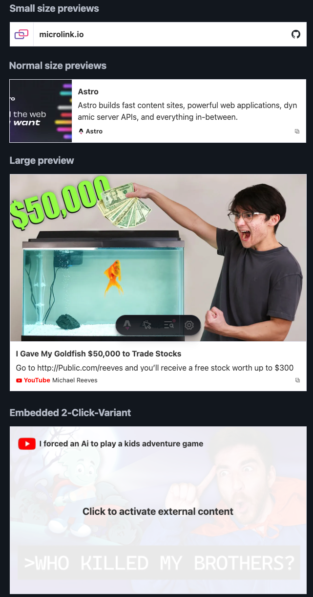

# astro-link-previews



[Demo / Usage / Configuration](https://suven.github.io/astro-link-previews/)

Provides a single component, to display links with thumb and description previews or 2-click iframe embeds. Ships as minimal third-party connections and
js as possible.

Powered by https://microlink.io/

## Setup

Install via `npm i astro-link-previews`.

If you wish to predownload all remote assets, adjust your `astro.config.mjs`:

```js
image: {
  //service: squooshImageService(),
  remotePatterns: [{ protocol: "https" }],
},
```

After that place a Card on any desires astro page:

```astro
---
import Card from "astro-link-previews";
---

<Card url="https://www.youtube.com/watch?v=L_JQOH1tEEA" />
```
